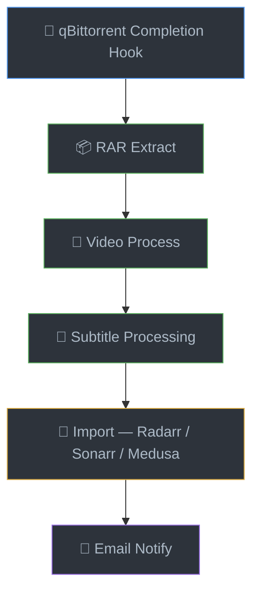
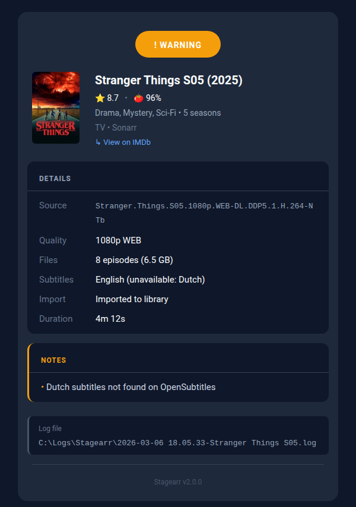
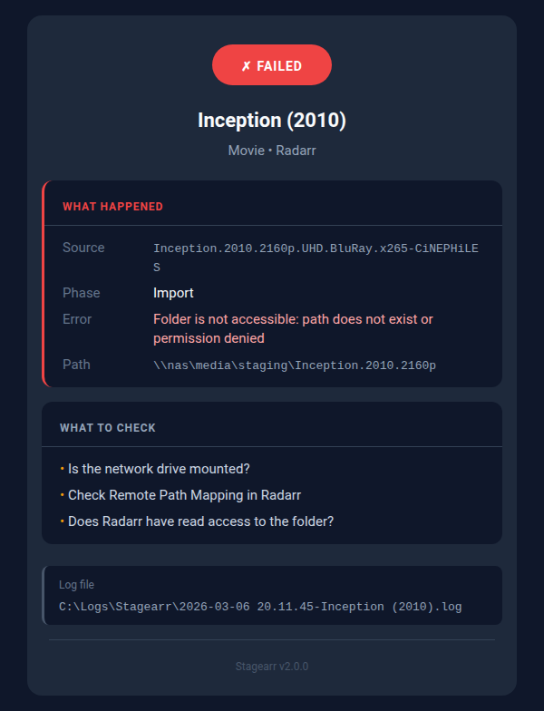
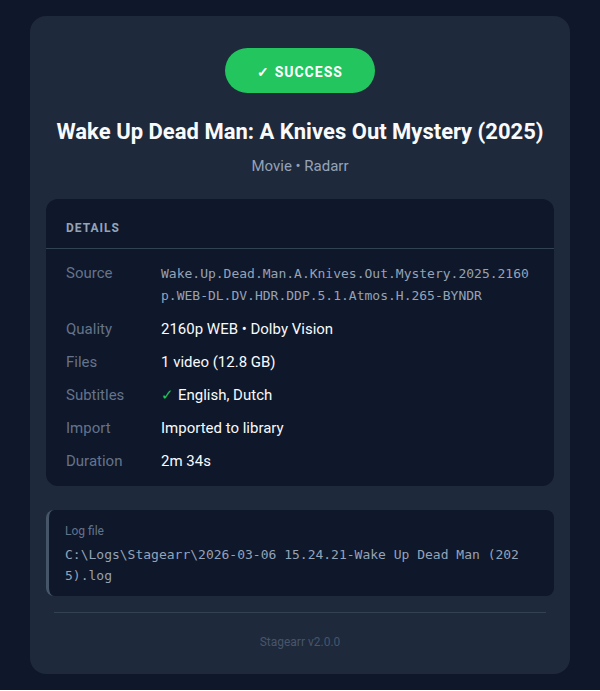

<p align="center">
  
  
  
  
</p>

<h1 align="center">🎬 Stagearr-ps</h1>

<p align="center">
  <strong>Automated Media Processing Pipeline for qBittorrent</strong>
</p>

<p align="center">
  Seamlessly process torrent downloads from completion to library — RAR extraction, MKV processing, subtitle acquisition, and automated import to Radarr, Sonarr, or Medusa.
</p>

---



---

> **Evolution of [TorrentScript](https://github.com/Rouzax/TorrentScript)** — Stagearr-ps is a complete rewrite with a modular architecture, event-based output system, job queue, subtitle pipeline, metadata enrichment, and many more features.

---

## ✨ Features at a Glance

| Feature | Description |
|---------|-------------|
| 📦 **RAR Extraction** | Automatically extract archives with WinRAR |
| 🎥 **Video Processing** | MP4→MKV remux, subtitle track stripping |
| 📝 **Subtitle Handling** | Extract, download from OpenSubtitles, clean with SubtitleEdit |
| 🔄 **Media Server Import** | Radarr, Sonarr, and Medusa integration |
| 📧 **Email Notifications** | Dark-themed HTML emails with configurable subject templates |
| 🎬 **Metadata Enrichment** | Movie posters, IMDb/RT/Metacritic ratings in emails |
| 📋 **Job Queue** | Persistent file-backed queue survives reboots |
| 🔒 **Safe Processing** | Global locks, security validation, atomic operations |

> 📖 **Detailed documentation:** [Wiki](https://github.com/rouzax/Stagearr-ps/wiki) · [Email Notifications](https://github.com/rouzax/Stagearr-ps/wiki/Email-Notifications) · [Subtitle Processing](https://github.com/rouzax/Stagearr-ps/wiki/Subtitle-Processing) · [Architecture](https://github.com/rouzax/Stagearr-ps/wiki/Architecture)

### 📧 Email Previews

<p align="center">
  
  
</p>
<p align="center">
  
  
</p>

<p align="center">
  <em>See all email types in the <a href="https://github.com/rouzax/Stagearr-ps/wiki/Email-Notifications">Email Notifications</a> wiki page.</em>
</p>

---

## 📦 Requirements

### PowerShell
- **PowerShell 5.1** (Windows built-in) or **PowerShell 7.x**

### External Tools

| Tool | Purpose | Required For |
|------|---------|--------------|
| [WinRAR](https://www.win-rar.com/) | Archive extraction | RAR processing |
| [MKVToolNix](https://mkvtoolnix.download/) | Video processing | MP4 remux, subtitle stripping |
| [SubtitleEdit](https://github.com/SubtitleEdit/subtitleedit) | Subtitle cleanup | SRT cleaning (optional) |

### Optional

- [Mailozaurr](https://github.com/EvotecIT/Mailozaurr) v2.x — Modern SMTP with inline poster images. Without it, emails fall back to `Send-MailMessage` (no inline images, no implicit SSL).

---

## 🔧 Installation

### 1. Download

```powershell
git clone https://github.com/rouzax/Stagearr-ps.git C:\Stagearr-ps
```

### 2. Configure

```powershell
# Interactive setup wizard (recommended)
.\Stagearr.ps1 -Setup

# Or copy sample and edit manually
Copy-Item config-sample.toml config.toml
```

### 3. Set Up qBittorrent

Go to **Tools → Options → Downloads** and set **Run external program on torrent finished:**

```
powershell.exe -ExecutionPolicy Bypass -File "C:\Stagearr-ps\Stagearr.ps1" -DownloadPath "%F" -DownloadLabel "%L" -TorrentHash "%I"
```

### 4. Install Optional Modules

```powershell
Install-Module Mailozaurr -AllowPrerelease
```

### 5. Upgrading

When updating Stagearr, check for new config settings:

```powershell
.\Stagearr.ps1 -SyncConfig
```

This reports missing/extra settings. Only settings you want to change from defaults need to be in your `config.toml`.

---

## ⚙️ Quick-Start Configuration

Minimal config to get running. See the **[full Configuration Reference](https://github.com/rouzax/Stagearr-ps/wiki/Configuration-Reference)** for all options.

```toml
[paths]
stagingRoot = "C:/Staging"
logArchive = "C:/Logs/Stagearr"
queueRoot = "C:/Stagearr-ps/Queue"

[tools]
winrar = "C:/Program Files/WinRAR/RAR.exe"
mkvmerge = "C:/Program Files/MKVToolNix/mkvmerge.exe"
mkvextract = "C:/Program Files/MKVToolNix/mkvextract.exe"
subtitleEdit = "C:/Program Files/Subtitle Edit/SubtitleEdit.exe"

[importers.radarr]
enabled = true
host = "localhost"
port = 7878
apiKey = "your_radarr_api_key"

[notifications.email]
enabled = true
to = "you@example.com"
from = "stagearr@example.com"

[notifications.email.smtp]
server = "smtp.gmail.com"
port = 587
user = "your_smtp_username"
password = "your_app_password"
```

> **Gmail Users:** Use an [App Password](https://support.google.com/accounts/answer/185833) instead of your regular password.

---

## 🎮 Usage

### Automatic (qBittorrent Hook)

Once configured, Stagearr runs automatically when torrents complete.

### Manual Processing

```powershell
# Process a specific download
.\Stagearr.ps1 -DownloadPath "C:\Downloads\Movie.2024" -DownloadLabel "Movie"

# Process with torrent hash (better import matching)
.\Stagearr.ps1 -DownloadPath "C:\Downloads\Movie.2024" -DownloadLabel "Movie" -TorrentHash "abc123..."
```

### Queue Status

```powershell
# Check queue status
.\Stagearr.ps1 -Status
```

### CLI Parameters

| Parameter | Description |
|-----------|-------------|
| `-DownloadPath` | Path to the downloaded torrent (file or folder) |
| `-DownloadLabel` | Torrent label/category (e.g., TV, Movie) |
| `-TorrentHash` | Torrent hash for better import matching |
| `-NoCleanup` | Skip staging folder cleanup after processing |
| `-SkipEmail` | Skip email notification |
| `-Force` | Re-run even if job already completed/failed |
| `-Wait` | Wait for job to complete before returning |
| `-Status` | Show queue status, running job details, and recent history |
| `-SyncConfig` | Report missing/extra settings vs config-sample.toml |
| `-Setup` | Interactive setup wizard for config.toml |
| `-ConfigPath` | Custom config.toml path |
| `-Verbose` | Show detailed troubleshooting output |

---

## 🏷️ Label System

### Media Labels

| Label Type | Labels | Import Target |
|------------|--------|---------------|
| **Movie** | `movie`, `radarr`, `film` | Radarr |
| **TV** | `tv`, `sonarr`, `series` | Sonarr or Medusa |

### Special Labels

| Label | Behavior |
|-------|----------|
| `skip` / `NoProcess` | Skip processing entirely |
| `NoMail` | Process but skip email notification |
| Unknown labels | **Passthrough mode** — extract/copy only, no video processing or import |

---

## 🔍 Troubleshooting

```powershell
# Check queue and job status
.\Stagearr.ps1 -Status

# Enable verbose output for detailed diagnostics
.\Stagearr.ps1 -DownloadPath "C:\Downloads\Movie" -DownloadLabel "Movie" -Verbose
```

**Common issues:**
- **Cannot connect to Radarr/Sonarr** — Check host, port, and API key in config
- **Path not accessible** — Check `remotePath` mapping for Docker/NAS setups
- **Subtitle extraction failed** — Verify MKVToolNix is installed; only text subtitles (SRT/ASS/WebVTT) can be extracted
- **Queue locked** — Run `-Status` to check for stuck jobs
- **Email issues** — Gmail requires App Passwords; use port 587 without Mailozaurr

> 📖 **Detailed troubleshooting:** [Wiki](https://github.com/rouzax/Stagearr-ps/wiki/Troubleshooting)

---

## 🤝 Contributing

Contributions are welcome! Please:

1. Fork the repository
2. Create a feature branch (`git checkout -b feature/amazing-feature`)
3. Commit your changes
4. Push and open a Pull Request

Follow PowerShell best practices, approved verbs, and the event-based output system for messaging.

---

## 📄 License

This project is licensed under the MIT License — see the [LICENSE](LICENSE) file for details.

---

## 🙏 Acknowledgments

- [MKVToolNix](https://mkvtoolnix.download/) — MKV manipulation tools
- [SubtitleEdit](https://github.com/SubtitleEdit/subtitleedit) — Subtitle editor
- [OpenSubtitles](https://www.opensubtitles.com/) — Subtitle database and API
- [Radarr](https://radarr.video/) / [Sonarr](https://sonarr.tv/) / [Medusa](https://pymedusa.com/) — Media management
- [Mailozaurr](https://github.com/EvotecIT/Mailozaurr) — Modern SMTP for PowerShell

---

<p align="center">
  <strong>Made with ❤️ for the home media enthusiast</strong>
</p>
