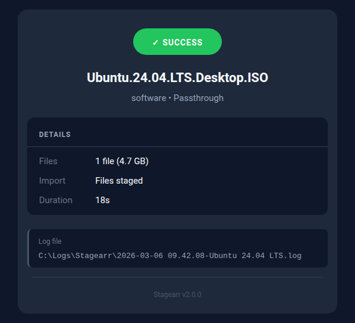

# Email Notifications

Stagearr sends a mobile-optimized, dark-themed HTML email at the end of every job. The email summarizes what happened, flags any warnings or errors, and optionally includes a movie poster with ratings.

---

## Email Types

| Type | Badge color | When it is sent |
|------|------------|-----------------|
| **Success** | Green | All phases completed; import accepted |
| **Warning** | Amber | Completed with notes (e.g., subtitles missing for one language) |
| **Failed** | Red | A phase failed; includes "What Happened" and "What to Check" |
| **Passthrough** | Green | Unknown label; files copied, no import |

<div style="display:flex;gap:12px;flex-wrap:wrap;margin:1em 0">
  
  
  
  
</div>

---

## Email Layout

A typical success email looks like this:

```
+-----------------------------------------------------+
|              +---------------------+               |
|              |    SUCCESS          |   (green)      |
|              +---------------------+               |
|                                                     |
|   Wake Up Dead Man: A Knives Out Mystery (2025)    |
|   Movie - Radarr                                   |
|                                                     |
|   +---------------------------------------------+  |
|   | DETAILS                                     |  |
|   +---------------------------------------------+  |
|   | Source      Wake.Up.Dead.Man.2025.2160p...  |  |
|   | Quality     2160p WEB - Dolby Vision        |  |
|   | Files       1 video (12.8 GB)               |  |
|   | Subtitles   English, Dutch                  |  |
|   | Import      Imported to library             |  |
|   | Duration    2m 34s                          |  |
|   +---------------------------------------------+  |
|                                                     |
|   Log: C:\Logs\2026-01-01_movie_wake-up-dead.log   |
|                                                     |
+-----------------------------------------------------+
```

**Quality row:** Automatically populated from the parsed release name (resolution, source, HDR format). For example: "2160p WEB - Dolby Vision" or "1080p BluRay - HDR10+". Omitted for passthrough jobs.

**Import row:** Shows the import outcome. Common values:

| Value | Meaning |
|-------|---------|
| Imported to library | The file was imported and is now in your library |
| Pending retry | Episode title is TBA in Sonarr; an automatic retry is scheduled for ~48 hours later |
| Skipped (quality exists) | A better-quality version already exists; the file was not replaced |

---

## Without Metadata Enrichment

When metadata is disabled or unavailable, the email still shows all processing details but omits the poster and ratings block.


---

## Subject Line Styles

Control the email subject with `notifications.email.subjectStyle`:

```toml
[notifications.email]
subjectStyle = "detailed"
```

| Style | Example |
|-------|---------|
| `detailed` | `Movie: Inception (2010) [2160p UHD-CiNEPHiLES]` |
| `quality` | `Movie: Inception (2010) [2160p]` |
| `source` | `Movie: Inception (2010) [BluRay-CiNEPHiLES]` |
| `group` | `Movie: Inception (2010) [-CiNEPHiLES]` |
| `hash` | `Movie: Inception (2010) [a1b2]` |
| `none` | `Movie: Inception (2010)` |
| `custom` | (your template) |

### Preset templates

Each preset is a shorthand for a fixed template:

| Preset | Equivalent template |
|--------|---------------------|
| `detailed` | `{result}{label}: {name} [{resolution} {source}-{group}]` |
| `quality` | `{result}{label}: {name} [{resolution}]` |
| `source` | `{result}{label}: {name} [{source}-{group}]` |
| `group` | `{result}{label}: {name} [-{group}]` |
| `hash` | `{result}{label}: {name} [{hash4}]` |
| `none` | `{result}{label}: {name}` |

### Custom templates

Set `subjectStyle = "custom"` and provide your own template:

```toml
[notifications.email]
subjectStyle = "custom"
subjectTemplate = "{result}{name} [{service} {resolution}]"
```

### Available placeholders

| Placeholder | Description | Example |
|-------------|-------------|---------|
| `{result}` | Status prefix (auto, empty on success) | `Failed: `, `Skipped: ` |
| `{label}` | qBittorrent label | `Movie`, `TV` |
| `{name}` | Friendly media name | `Inception (2010)` |
| `{resolution}` | Video resolution | `2160p`, `1080p` |
| `{source}` | Media source | `UHD`, `BluRay`, `WEB` |
| `{group}` | Release group | `NTb`, `CiNEPHiLES` |
| `{service}` | Streaming service | `NF`, `AMZN`, `DSNP` |
| `{hash4}` | First 4 characters of torrent hash | `a1b2` |

**Smart cleanup:** Empty placeholders and orphaned brackets are removed automatically. For example, `[2160p -]` becomes `[2160p]` when no release group is known.

---

## Metadata Enrichment

When metadata enrichment is enabled, emails include a poster image and ratings block:

```
+----------+  Wake Up Dead Man: A Knives Out Mystery (2025)
|          |  IMDb 7.4  -  RT 85%  -  MC 80
|  POSTER  |  Comedy, Crime, Drama  -  144 min
|   80px   |  Movie - Radarr
|          |  -> View on IMDb
+----------+
```

### Metadata sources

| Source | Provides | Requires |
|--------|----------|---------|
| Radarr / Sonarr | Ratings, genre, runtime, plot | No extra config |
| OMDb | Poster image (~25 KB), IMDb ID, ratings | Free API key |

### How it works

The `metadata.source` setting controls which sources are used:

```toml
[notifications.email.metadata]
source = "auto"   # auto | omdb | none
```

| Value | Behavior |
|-------|---------|
| `auto` | Merges ratings and genre from your `*`arr server with the OMDb poster. Falls back to whichever source is available. |
| `omdb` | Uses OMDb only (ignores `*`arr metadata) |
| `none` | Disables metadata enrichment entirely |

In `auto` mode, the pipeline queries OMDb early (during Initialize) using the IMDB ID from the `*`arr queue, then merges the result with metadata returned by the import scan. This gives a reliable small poster from OMDb and rich rating data from Radarr or Sonarr.

If metadata lookup fails for any reason (title mismatch, API timeout, quota exceeded), the email renders normally without enrichment. Metadata failure never blocks job completion.

---

## OMDb Setup

OMDb is optional but recommended for poster support. It is especially important for Medusa users, since Medusa does not return the ratings and genre data that Radarr and Sonarr provide.

1. Get a free API key at [omdbapi.com](https://www.omdbapi.com/apikey.aspx) (1,000 requests per day)
2. Enable in config:

```toml
[omdb]
enabled = true
apiKey = "your_api_key"
timeoutSeconds = 5

[omdb.poster]
enabled = true

[omdb.display]
plot = false          # Set true to include a plot summary in the email
plotMaxLength = 150
```

Ratings, genre, runtime, and season count are always shown when available. The `plot` setting controls whether a plot synopsis is added.

---

## Mailozaurr (Recommended)

For poster images embedded directly in the email body (inline CID attachments), install [Mailozaurr](https://github.com/EvotecIT/Mailozaurr) v2.x:

```powershell
Install-Module Mailozaurr -AllowPrerelease
```

Without Mailozaurr, Stagearr falls back to the built-in `Send-MailMessage` cmdlet. This fallback does not support inline images or implicit SSL (port 465). The email is still sent and all text content is present, but the poster image will not be embedded.

---

## SMTP Configuration

```toml
[notifications.email]
enabled = false
to = "you@example.com"
from = "stagearr@example.com"
fromName = "Stagearr"

[notifications.email.smtp]
server = "smtp.gmail.com"
port = 587
user = "your_smtp_username"
password = "your_smtp_password_or_app_password"
```

For all available settings, see the [Settings Reference](settings-reference.md).
