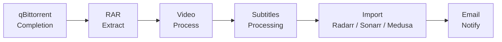

# Stagearr

**From completed torrent to media library, automatically.**

Stagearr is a PowerShell post-processing pipeline for qBittorrent. When a torrent finishes, Stagearr takes over: it extracts archives, converts video if needed, handles subtitles, imports the result into Radarr, Sonarr, or Medusa, and sends you an email summary. The whole process is hands-off and resumable across reboots.

---

## How It Works

The pipeline runs these phases in order for every job:

1. **Initialize** - load config, create job context, set up logging
2. **Stage** - copy or extract files to a staging folder
3. **Video** - extract from RAR archives, remux MP4 to MKV, strip unwanted subtitle tracks
4. **Subtitles** - extract embedded subtitles, download from OpenSubtitles, clean with SubtitleEdit
5. **Import** - submit to Radarr, Sonarr, or Medusa via ManualImport API; poll for completion
6. **Notify** - write log file, send HTML email notification

Before Stage runs, Stagearr checks for dangerous files (executables, scripts). If any are found, the job is aborted. When the download is still in the Radarr or Sonarr queue, Stagearr also removes and blocklists it to prevent re-download.

---

## What It Does

| Feature | Description |
|---------|-------------|
| **RAR Extraction** | Automatically extract single and multi-part RAR archives using WinRAR |
| **Video Processing** | Remux MP4 files to MKV; strip unwanted embedded subtitle tracks |
| **Subtitle Handling** | Extract tracks from MKV, download from OpenSubtitles, clean up with SubtitleEdit |
| **Media Server Import** | Full Radarr, Sonarr, and Medusa integration via ManualImport API |
| **Email Notifications** | Dark-themed HTML emails with configurable subject line templates |
| **Metadata Enrichment** | Movie posters, IMDb / Rotten Tomatoes / Metacritic ratings in notification emails |
| **Job Queue** | Persistent file-backed queue; survives reboots and process crashes |
| **Safe Processing** | Heartbeat-based global lock, path traversal prevention, zip-slip protection |
| **MDBList Collection Sync** | Mark imported movies and episodes as In Library on MDBList |

---

## Documentation Map

| Page | What you will find |
|------|--------------------|
| **[Installation](installation.md)** | Requirements, download, and first-time setup |
| **[qBittorrent Integration](qbittorrent.md)** | Configuring qBittorrent to trigger Stagearr on completion |
| **[Quick Start](quick-start.md)** | Get your first job processed end-to-end |
| **[Pipeline Overview](pipeline.md)** | Detailed walkthrough of every processing phase |
| **[Video Processing](video-processing.md)** | RAR extraction, MP4-to-MKV remux, track stripping |
| **[Subtitle Processing](subtitles.md)** | Extract, download, and clean subtitles |
| **[Importing](importing.md)** | How Radarr, Sonarr, and Medusa imports work |
| **[Email Notifications](email.md)** | Template syntax, metadata, and preview |
| **[MDBList Collection Sync](mdblist.md)** | Mark imports as collected on MDBList |
| **[Configuration Overview](configuration.md)** | TOML config file structure and sync workflow |
| **[Settings Reference](settings-reference.md)** | Every setting, its default, and what it controls |
| **[Labels and Content Routing](labels.md)** | How download labels map to TV, movie, or passthrough processing |
| **[CLI Usage](cli-usage.md)** | All command-line parameters and modes |
| **[Job Queue and Locking](queue-locking.md)** | Queue states, global lock, multi-machine operation |
| **[Re-running Jobs](rerun.md)** | Interactively re-process a recent completed or failed job |
| **[Auto-Update](updates.md)** | Checking for and applying updates |
| **[Troubleshooting](troubleshooting.md)** | Common problems, symptoms, and fixes |

---

## Quick Links

- **[GitHub Repository](https://github.com/Rouzax/Stagearr-ps)**
- **[Latest Release](https://github.com/Rouzax/Stagearr-ps/releases/latest)**
- **[Report a Bug](https://github.com/Rouzax/Stagearr-ps/issues/new)**
