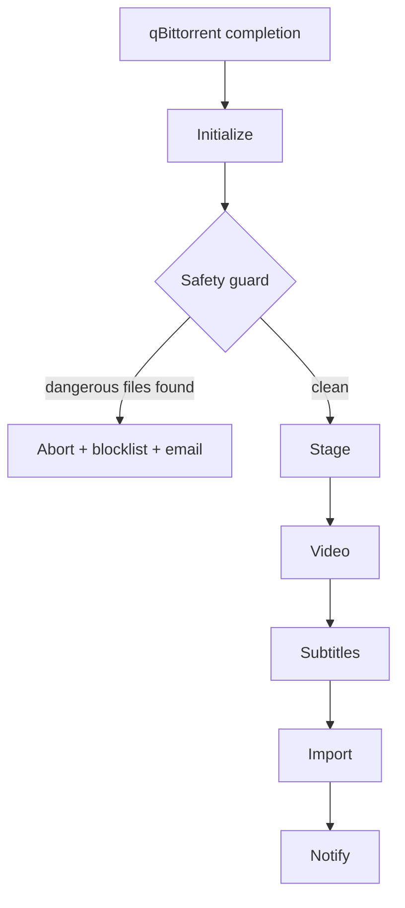

# Pipeline Overview

Every job Stagearr processes follows the same six phases in order. Understanding the pipeline helps you configure each phase, diagnose problems, and know what to expect in the email notification.

---

## The Six Phases

### 1. Initialize

Stagearr loads your `config.toml`, creates the job context, and initializes the output system. The context carries configuration, file paths, and state through every subsequent phase.

This is also where the release name is parsed to extract quality metadata (resolution, source, HDR format, release group, streaming service) that feeds the email subject line and quality row.

For Radarr and Sonarr jobs, Stagearr queries the `*`arr queue and history APIs at this point to look up the IMDB ID and title. That result is cached and used for OMDb metadata lookup and later during import, avoiding a duplicate API call.

### 2. Stage

Files are copied or extracted from the download folder into a dedicated staging folder under `paths.stagingRoot`. The staging folder is a working area isolated from your download client. If anything goes wrong after this point, the original download is untouched.

Before staging begins, Stagearr runs a safety guard. See [Safety Guard](#safety-guard) below.

### 3. Video

This phase processes the staged video files. The work done here depends on the file type and your configuration:

- **RAR archives** are extracted using WinRAR before any other processing occurs
- **MP4 and M4V files** are remuxed into MKV containers (if enabled via `[video.mp4Remux]`)
- **MKV files** are analyzed for subtitle track composition; unwanted tracks are stripped using mkvmerge

The Video phase hands off the resulting MKV files to the next phase. See [Video Processing](video-processing.md) for full details.

### 4. Subtitles

Stagearr handles subtitles in this order: strip unwanted tracks from the MKV, extract remaining text tracks to SRT files, download missing languages from OpenSubtitles, clean all SRT files with SubtitleEdit, and optionally upload cleaned subtitles back to OpenSubtitles.

Each step is independently togglable via feature flags. See [Subtitle Processing](subtitles.md) for full details.

### 5. Import

Stagearr submits the staged files to your media server using the ManualImport API. The dispatcher routes by label and config: movies go to Radarr, TV shows go to Sonarr or Medusa depending on `processing.tvImporter`. The flow is: scan the staging folder, identify importable files, execute the import, then poll for completion.

Before sending files to the importer, Stagearr verifies it still owns the global lock to prevent a double-import if the lock was taken by another worker during a long pause.

See [Importing](importing.md) for full details.

### 6. Notify

The staging folder is cleaned up (unless `processing.cleanupStaging = false`). Stagearr writes the verbose job log to `paths.logArchive`, then builds and sends the HTML email notification.

The email includes processing details (source name, quality, file count, subtitle languages, import result, duration), any warnings or errors, and optionally a movie poster with ratings from OMDb and your `*`arr server.

See [Email Notifications](email.md) for full details.

---

## Safety Guard

Before the Stage phase runs, Stagearr scans the download for dangerous files: executables, scripts, and similar file types (`.exe`, `.msi`, `.bat`, and others). If any are found, the job is aborted immediately.

This check only applies to TV and Movie labels. Passthrough jobs are unaffected.

When the download is still present in the Radarr or Sonarr queue at the time of the check, Stagearr also removes it from the queue and blocklists it to prevent re-download. If no queue record is available (the torrent had already left the queue), a warning is logged and the item is not blocklisted automatically.

A "Blocked" email is sent so you know what happened and can investigate.

---

## Passthrough Mode

If a download's label does not match any entry in `labels.tvLabels` or `labels.movieLabels`, Stagearr runs in passthrough mode. Files are copied or extracted to staging, but no video processing, subtitle handling, or import is performed. The email shows a simplified "Success" view with file count and size.

Passthrough mode does not trigger the safety guard.

---

## Phase Diagram

---

## Quick Reference

| Phase | What happens | Config section |
|-------|-------------|----------------|
| Initialize | Load config, parse release name, query `*`arr metadata | `[paths]`, `[omdb]` |
| Stage | Copy or extract files to staging folder | `[paths]`, `[processing]` |
| Video | RAR extract, MP4 remux, MKV subtitle strip | `[video.mp4Remux]`, `[subtitles.stripping]` |
| Subtitles | Extract, download, clean, upload subtitles | `[subtitles.*]` |
| Import | Scan, import, poll in Radarr / Sonarr / Medusa | `[importers.*]`, `[processing]` |
| Notify | Write log, send email | `[notifications.email]`, `[omdb]` |

For every available setting, see the [Settings Reference](settings-reference.md).
